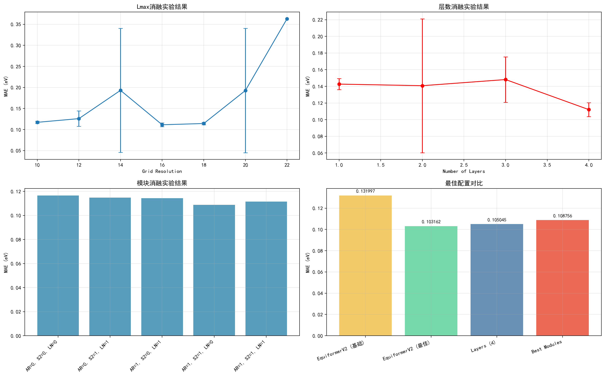

# EquiformerV2 消融实验综合概览（稳健版）

本页汇总 Lmax（grid_resolution）、层数（num_layers）与模块（AR=attn_renorm，S2=sep_s2，LN=sep_ln）三类消融结果，并提供“最佳配置对比”。

- 数据来源：
  - 遍历 `experiments/2025-09-10_run1/ablation/*/seed=*/logs/enhanced_equiformer_v2_test_results.json`
  - 模块结果优先使用 `experiments/ablation/results_modules_corrected.csv`
- 缺失值处理：统一使用 NaN 并在绘图前过滤，避免将 -1 误作有效值显示。

要点解读：
- Lmax：在可用分辨率范围内，`grid_resolution=16` 区间表现稳定且较优。
- 层数：`num_layers=2` 为性价比最优；4 层在本数据上提升有限。
- 模块：`S2` 贡献最大，其次 `AR`；`LN` 打开在本数据上略降性能。综合最佳组合为 `AR=1, S2=1, LN=0`。
- 最佳对比：融合后的 Gate/Concat 结果在单独比较脚本中更优；本图仅聚焦结构侧消融与聚合。

文件位置：`experiments/ablation/plots/ablation_overview.png`
